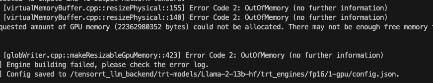

# Productionizing and Scaling Machine Learning Models on OCI [TUT3635]

In this guide, we will show you how to deploy NVIDIA Triton with TensorRT-LLM backend on Oracle Cloud Infrastructure (OCI).

TensorRT-LLM is currently pre-GA and can be obtained through NVIDIA's Partners Portal.

For this tutorial, you will need two files: 
[tensorrt_llm_backend_aug-release-v1.tar.gz] (https://partners.nvidia.com/DocumentDetails?DocID=1105343)
[tensorrt_llm_aug-release-v1.tar.gz (CUDA 12.1)] (https://partners.nvidia.com/DocumentDetails?DocID=1105342)

Please download both files to `${HOME}/trt-llm/`

### Prerequisites
1. An OCI GPU instance.  We used VM.GPU.A10.2 shape, which has 2 NVIDIA A10 GPUs
2. NVIDIA GPU driver
3. Docker and NVDIA GPU Toolkit
4. Llama 2 13B model in HuggingFace format downloaded to directory: `${HOME}/trt-llm/models/Llama-2-13b-hf`

### Build TRT-LLM backend with Triton server
```bash
cd ${HOME}/trt-llm/
tar xvf tensorrt_llm_backend_aug-release-v1.tar.gz
cd tensorrt_llm_backend_aug-release-v1
tar xvf ../tensorrt_llm_aug-release-v1.tar.gz

docker build -t tensort_llm_backend -f dockerfile/Dockerfile.trt_llm_backend .
```
Now we start the TRT-LLM backend container in interactive mode.  You will see a Bash command prompt once the container starts. 
```
docker run --gpus all -e LOCAL_USER_ID=`id -u ${USER}` --shm-size=8g --net=host --ulimit memlock=-1 --rm -it \
        -v ${PWD}:/tensorrt_llm_backend \
        -v $(dirname $PWD)/models:/models \
        -w /tensorrt_llm_backend tensort_llm_backend bash
```
At the commmand prompt inside the container, we first install the required Python packages.
```
pip install /app/tensorrt_llm/build/tensorrt_llm*.whl
pip install -r /app/tensorrt_llm/examples/llama/requirements.txt
```

Now we can build the LLaMA 2 13B TRT engine for a single GPU
```
cd /app/tensorrt_llm/examples/llama
python3 build.py --model_dir /models/Llama-2-13b-hf \
                --dtype float16 \
                --use_gpt_attention_plugin float16 \
                --use_gemm_plugin float16 \
                --output_dir /tensorrt_llm_backend/trt-models/Llama-2-13b-hf/trt_engines/fp16/1-gpu/
```



Oops, we got an OOM error. 

> Quiz:
> 1. Why did we get OOM error?
> 2. What are the possible solutions
>

Solution #1: Quantization using INT4
```
python3 build.py --model_dir /models/Llama-2-13b-hf \
                --dtype float16 \
                --use_gpt_attention_plugin float16 \
                --use_gemm_plugin float16 \
                --use_weight_only \
                --weight_only_precision int4 \
                --output_dir /tensorrt_llm_backend/trt-models/Llama-2-13b-hf/trt_engines/int4/1-gpu/
```
Before we launch the Triton server, we need to tell it where to find the TRT engine we just built. You can use your favorite editor to edit `/tensorrt_llm_backend/all_models/gpt/tensorrt_llm/config.pbtxt` or use sed to replace ${engine_dir} with the path to our new TRT engine. 
```
sed -i "s@\${engine_dir}@/tensorrt_llm_backend/trt-models/Llama-2-7b-hf/trt_engines/fp16/1-gpu/@g" /tensorrt_llm_backend/all_models/gpt/tensorrt_llm/config.pbtxt
```

Now we launch the Triton server with our quantized LLaMA 2 13B model. 
```
cd /tensorrt_llm_backend

# Single GPU
python3 scripts/launch_triton_server.py  \
    --model_repo=all_models/gpt
```
Now we should see the quantized LLaMA 2 13B model was loaded by Triton server and only 1 of the 2 GPUs was used. 
<images/quantized_nvdiai-smi.png>
<images/triton_ready.png>

Solution #2: Tensor Parallelism
```
python3 build.py --model_dir /models/Llama-2-13b-hf \
                --dtype float16 \
                --use_gpt_attention_plugin float16 \
                --use_gemm_plugin float16 \
                --output_dir /tensorrt_llm_backend/trt-models/Llama-2-13b-hf/trt_engines/fp16/2-gpu/ \
                --world_size 2
```
Now we edit `/tensorrt_llm_backend/all_models/gpt/tensorrt_llm/config.pbtxt` and point Triton server to the new model optimized for 2 GPUs.

Next, we launch the Triton server with Tensor Parallelsm accross 2 GPUs.
```
python3 scripts/launch_triton_server.py \
    --model_repo=all_models/gpt \
    --world_size=2
```
Once the Triton server starts, we can see both GPUs are used this time. 
!(images/quantized_nvdiai-smi_2gpus.png)


